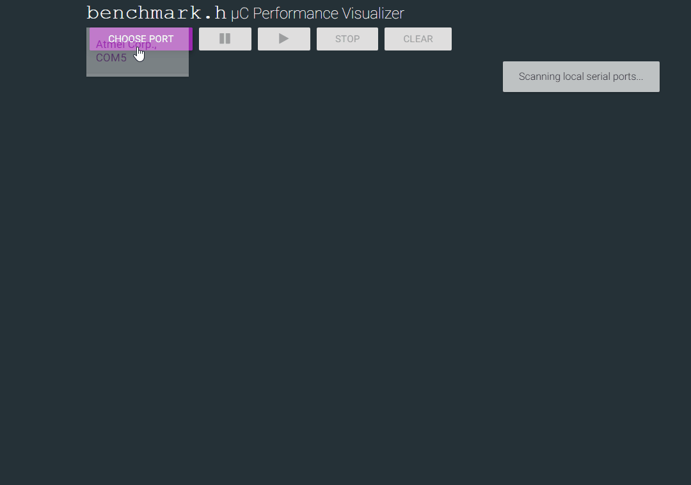

# c-benchmark-visualizer
This is a tool for analyzing the performance time of C-based microcontroller applications in realtime.



Here's what you need:

*  A computer with a USB port
*  A [Particle Photon](http://particle.io) (although you can easily port the provided C++ to use an Arduino or anything else that can handle 2 simultaneous serial connections)
*  An embedded C project on a uC with at least one available USART TX pin

How does it work?  The attached C code will provide a mechanism for your embedded code to send signals to the Photon that describe where in your code the uC is, by using a single USART pin connection.  We connect the Photon to the computer, and use a local electrified Meteor app to chart high fidelity timestamp results streaming from it in realtime.

In a nutshell, the project consists of three main parts:

*  In your embedded C project, include `benchmark.h`.  This provides the `benchmark(label)` command that will emit timer signals.
*  `application.cpp` is Photon firmware that allows the Photon to act as an application stopwatch and report the results to the PC by USB.
*  The Meteor app, which graphs the results streaming from the Photon in realtime.

## Setup

### Flash the Photon
There are two ways to do this -- through the Particle cloud, or by compiling and flashing locally.

#### Flash the Photon OTA
This is the easiest option.  Inside the [Photon cloud IDE](http://build.particle.io), create a new project.  Copy paste the contents of `Photon/benchmark-visualizer/application.cpp` into the editor.  **Note**: make sure to remove this line from the top if you're compiling in the cloud:

```cpp
  #include "application.h"
```

Then, just compile and flash to your Photon!

#### Compile and Flash Locally
1.  First, clone the latest vanilla Photon firmware.
  ```bash
    git clone git@github.com:spark/firmware
    cd ./firmware
    git checkout latest
  ```

1.  Plug the Photon in, and put it into DFU mode (flashing yellow).  Go into the `/modules` folder, build the vanilla firmware and flash it to the Photon.  Then move back up to `/firmware`.
  ```bash
    cd ./modules
    sudo make PLATFORM=photon clean all program-dfu
    cd ..
  ```

1.  Next, copy `application.cpp` into its own application folder inside `/firmware/user/applications`.
  ```bash
    cp r c-benchmark-visualizer/Photon/benchmark-visualizer ./user/applications
  ```

1.  Go into the `/main` folder and compile it.  Then move back up to `/firmware`.
  ```bash
    cd ./main
    sudo make PLATFORM=photon APP=benchmark-visualizer
    cd ..
  ```

1.  Finally, flash the compiled firmware to the Photon!  Make sure it's in DFU mode.
  ```bash
    sudo particle flash --usb build/target/user-part/platform-6-m/benchmark-visualizer.bin
  ```

### Implement `benchmark.h` into your uC Application
Copy `C/benchmark.h` into your microcontroller project.  Include it with `#include "benchmark.h"`.  This will give you two commands to use in your project.

Command | Use
---|---
`benchmark_sync()` | Call this method once at the very beginning of your code's `while` loop.  It keeps your measurements in sync, and also defines the order of measurements to be reported.
`benchmark(label)` | Call this method anywhere in your C code to find out how much time has elapsed since the last `benchmark()` call.  `label` is just a string that describes that point in the code -- it will become the label of the corresponding bar in the visualizer chart.  *Therefore, it is important you always use a unique `label` for every `benchmark(label)` call.*

**It is very important that the USART bus you are using to connect your uC to the Photon is configured to have a 115200 baud rate.**  Otherwise, the Photon's firmware will not catch the `benchmark()` signals!

### Connect the uC to the Photon
`benchmark.h` uses `printf()` to output timestamp labels to the Photon.  So you'll need to connect the USART TX pin of your uC to the RX pin of the Photon, and make sure that `printf()` is configured to that TX pin's register.

### Launch the Meteor App
```bash
  cd c-benchmark-visualizer/Meteor
  meteor
```

Meteor will find and download depencies, and then launch the app in its own window.  You may also access it by visiting http://localhost:3000 in your browser.

> Hint:  If the console throws errors immediately after `electrify: launching electron`, try manually installing the electrify dependencies: `cd ./electrify && npm install`.  Then re-run `meteor`.

Once it's loaded, click "CHOOSE PORT" in the upper left, and look for an option that says "Particle."  That'll be the Photon.  If the Photon has the firmware as described above, and is serially connected to your uC running the `benchmark.h` code, the app will start live-plotting the elapsed time between each `benchmark()` call.
